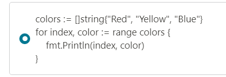
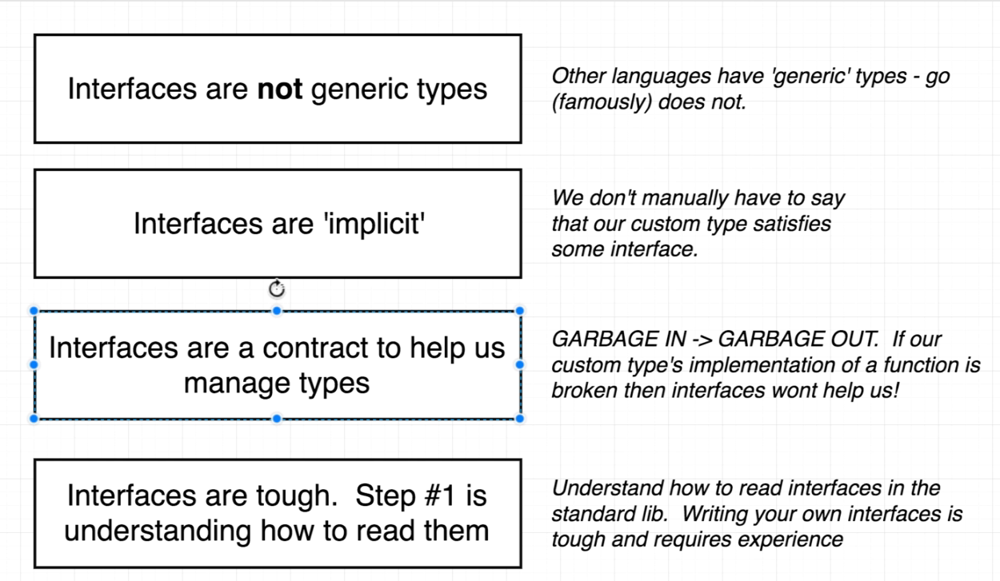
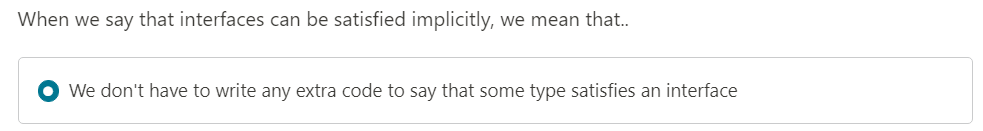

# Go-Udemy
* Iterate over a slice
  
  
* Value Types vs Reference Types

  
* Creating a slice

  
* Map vs Struts

  
* Interfaces notes
  
  
  
  

# Some notes
  * Go avoids any mentions of 'this' or 'self'
  * We arent limited to only return two values in a fuction

