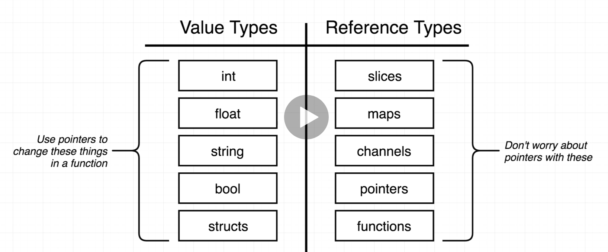
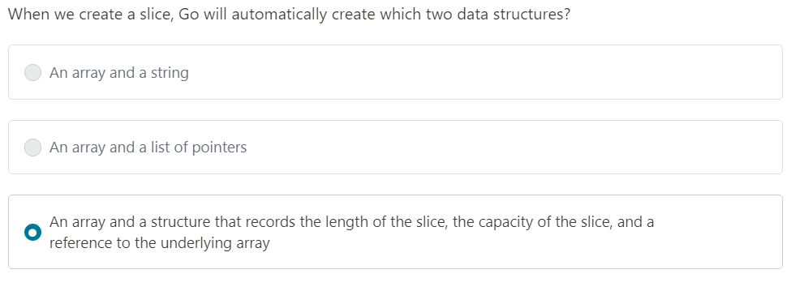
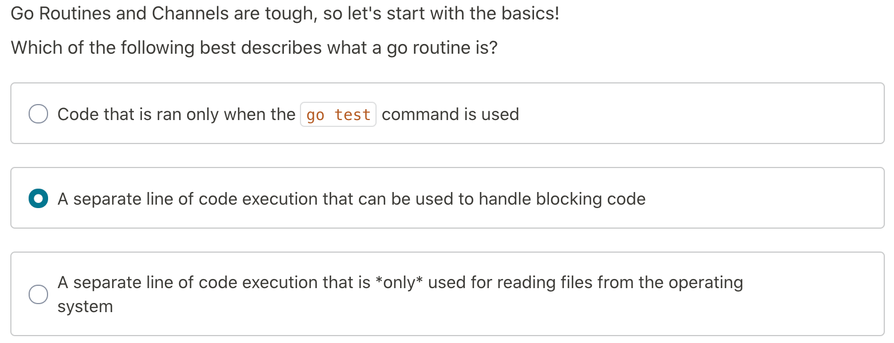
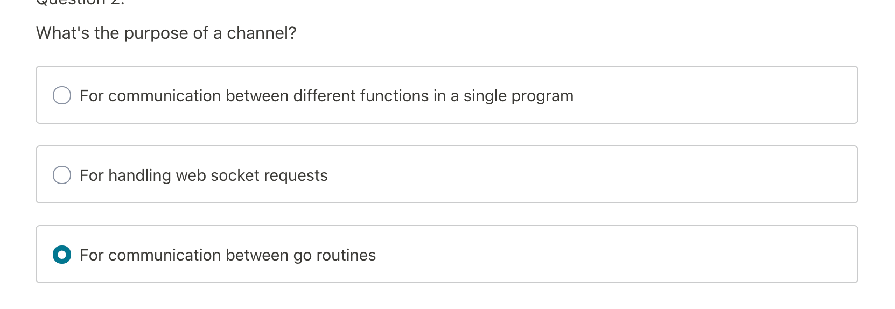

# Go-Udemy
* Iterate over a slice
 
  
* Value Types vs Reference Types

  
* Creating a slice

  
* Map vs Struts

  
* Interfaces notes
    
    

* Channels & Routines

  
  

# Some notes
  * Go avoids any mentions of 'this' or 'self'
  * We arent limited to only return two values in a fuction

:= --> Operador "corto" buena practica utilizarlo dentro de bloques de codigo para declarar e inicializar variables
var --> Palabra reservada para declarar e inicializar variables preferentemente globales

"" --> Lo que este dentro es un string literal interpretado, no se pueden realizar saltos de linea en el

` ` --> String en el que se pueden realizar saltos de linea, te conserva el formato del texto tal cual esta.

En Go todo es un tipo (como en Java todo es un objeto)

El casteo se conoce como "conversion"

golang.org vs godoc, la diferencia es que godoc tiene ademas de la documentacion, paquetes de terceros

Las constante sin tipo dan flexibilidad a la hora de asignarselas a cualquier otra variable

iota --> identificador predeclarado que permite hacer constantes sucesivas

el for se puede usar de 3 formas:
	init ; condition ; post
	for condition {} reemplaza al do while
	for range

en el if, podes inicializar la variable q vas a comprarar en la misma linea: if x:=42; x> 100 { code }

En la clausula switch 
	dentro del case utilizando fallthrough se realiza la accion siguiente al case que la invoco

	Se pueden utilizar multiples condiciones en un solo case

	Si no se pone condicion se evalua con true

------------------------------------------------------------------

go build 	--> buildea
go run 		--> buildea y corre
go fmt 		--> formatea todo el codigo
go install 	--> compila e instala paquetes
go get 		--> te trae todos los paquetes de terceros
go test 	--> corre todos los test

hay 2 tipos de package, los ejecutables y los reusables, para poder diferenciarlos, todos los ejecutables deben estar contenidos dentro del package "main"

--------------------------------------
El array tiene tamaño fijo
El slice puede crecer o achicarse a medida

